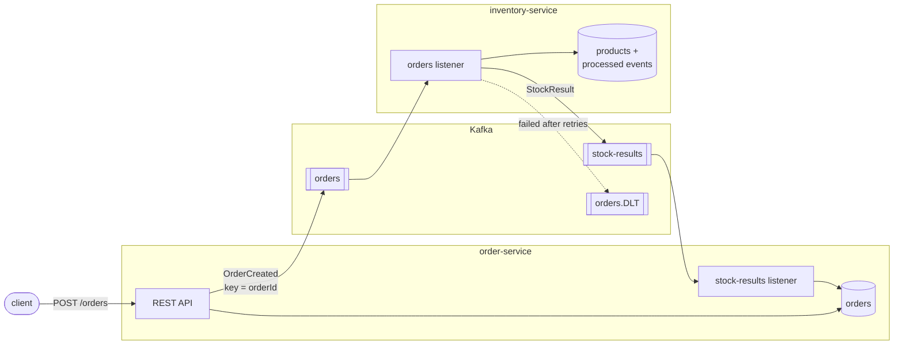
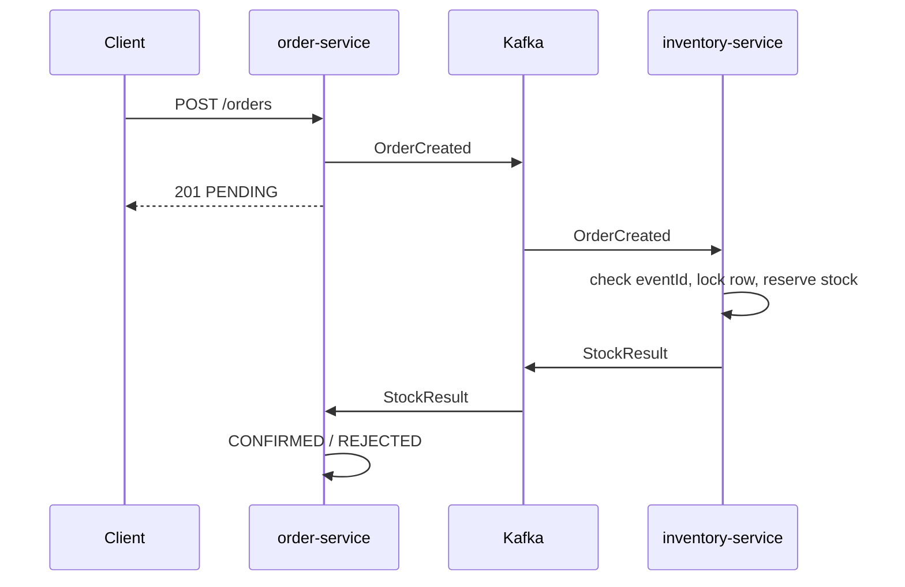

<h1 align="center">Hi there, I'm Arda 👋</h1>

  

  Computer programming student and full-stack developer. I build backend services, automation that
  runs at real customers, and small open-source tools for software made in Türkiye.

  
  
  
  
  
  
  
  
  
  
  
  
  
  
  
  
  
  
  
  
  
  

---

## ⭐ Featured — [spring-kafka-orders](https://github.com/ardazeybek-dev/spring-kafka-orders)

Two Spring Boot microservices that talk only through Apache Kafka: key-based ordering, parallel
consumers with row locking, retries, a dead letter topic and idempotent consumers — each failure
triggered by hand and covered by a test.

Order lifecycle

---

## 📦 Packages

| Package | What it does |
| --- | --- |
| **[trkit](https://github.com/ardazeybek-dev/trkit)** | Correct Turkish casing (`i` → `İ`), TCKN, IBAN and plate validation · `pip install trkit` |
| **[kvkk](https://github.com/ardazeybek-dev/kvkk)** | Finds and masks Turkish personal data in files, logs and dumps · `pip install kvkk` |
| **[bordro](https://github.com/ardazeybek-dev/bordro)** | Turkish payroll: gross ↔ net with cumulative income tax · TypeScript |

## 🧩 Apps

| App | What it does |
| --- | --- |
| **[aktar](https://github.com/ardazeybek-dev/aktar)** | Reads a bank statement, matches payments to people, fills the web panel · in use at a customer |
| **[chatterfix](https://github.com/ardazeybek-dev/chatterfix)** | Windows tray app that fixes the phantom double click of a worn mouse · C# / .NET |

## 🎨 In the Browser

**[K.I.T.T.](https://github.com/ardazeybek-dev/K.I.T.T)** — Knight Rider cockpit with an LLaMA-3 brain, one HTML file · [live demo](https://kitt-arda.shipstatic.com)

More projects on my [repositories page](https://github.com/ardazeybek-dev?tab=repositories).

---

## 🐍 Watch the Snake Eat My Contributions

  <picture>
    <source media="(prefers-color-scheme: dark)" srcset="https://raw.githubusercontent.com/ardazeybek-dev/ardazeybek-dev/output/github-snake-dark.svg" />
    <source media="(prefers-color-scheme: light)" srcset="https://raw.githubusercontent.com/ardazeybek-dev/ardazeybek-dev/output/github-snake.svg" />
    
  </picture>

---

  

---

  
  
  
  

  

